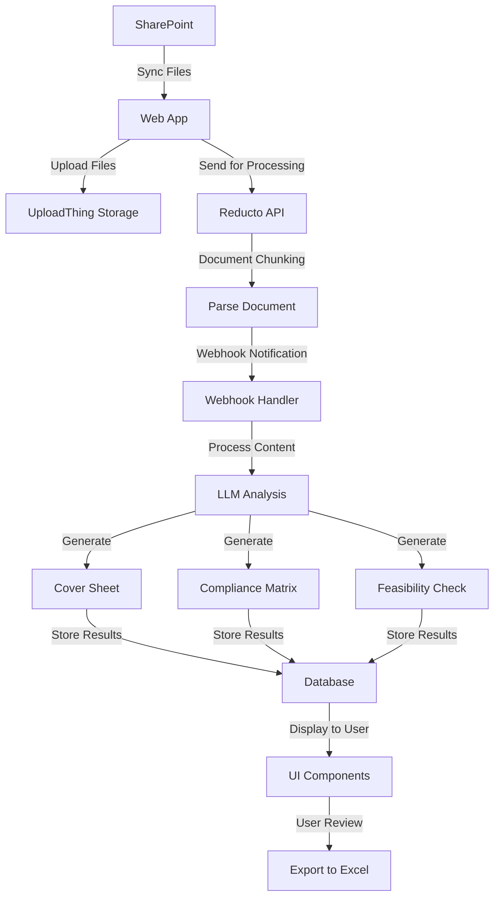

# Z-Bids: RFP Document Analyzer

Z-Bids is a powerful document analysis platform designed to streamline the process of analyzing Request for Proposal (RFP) documents. It integrates with SharePoint, uses AI for document analysis, and provides a comprehensive interface for managing and analyzing RFP files.

## 🌟 Features

- **Document Synchronization**: Automatically syncs documents between SharePoint and UploadThing
- **AI-Powered Analysis**: Leverages OpenAI to analyze RFP documents and extract key information
- **Cover Sheet Generation**: Automatically creates structured cover sheets from RFP documents
- **Compliance Matrix**: Generates compliance matrices to track requirement fulfillment
- **Feasibility Assessment**: Evaluates and scores RFP requirements against organizational capabilities
- **Document Management**: Organize documents in folders with search and filter capabilities
- **Excel Export**: Export analysis results to Excel for further processing

## 🚀 Technologies

- **Frontend**: 
  - Next.js 15
  - React 19
  - TailwindCSS
  - HeroUI Components
  - TypeScript

- **Backend**:
  - Next.js Server Components & API Routes
  - Drizzle ORM with PostgreSQL
  - Microsoft Graph API
  - OpenAI API
  - UploadThing for file storage

- **Integration**:
  - SharePoint 
  - Reducto API for document processing
  - XLSX for Excel file generation

## 📋 Prerequisites

Before you begin, ensure you have:

- Node.js 20 or later
- npm or yarn
- PostgreSQL database
- SharePoint access with appropriate permissions
- API keys for OpenAI and UploadThing

## 🛠️ Installation & Setup

1. **Clone the repository**
   ```bash
   git clone https://github.com/your-username/z-bids.git
   cd z-bids
   ```

2. **Install dependencies**
   ```bash
   npm install
   ```

3. **Set up environment variables**  
   Copy the `.env.example` file to a new `.env` file and update with your actual credentials:
   ```bash
   cp .env.example .env
   ```
   Then edit the `.env` file with your specific API keys, database connection details, and other configuration values.

4. **Run database migrations**
   ```bash
   npx drizzle-kit push
   ```

5. **Start the development server**
   ```bash
   npm run dev
   ```
   The application will be available at http://localhost:3000

## 🏗️ Project Structure

```
z-bids/
├── src/
│   ├── app/              # Next.js app router pages and API routes
│   ├── components/       # React components
│   ├── lib/              # Utility libraries and client-side functions
│   ├── server/           # Server-side modules and services
│   │   ├── modules/      # Core server functionality
│   │   └── openai/       # OpenAI integration for document analysis
│   └── types.ts          # TypeScript type definitions
├── drizzle/              # Database schema and migrations
├── public/               # Static assets
└── ...config files
```

## 🔄 Workflow

1. **Document Upload**:
   - Upload RFP documents directly or sync from SharePoint
   - Files are stored in UploadThing for processing

2. **Document Analysis**:
   - AI analyzes the document structure and content
   - Extracts key information like requirements, deadlines, etc.
   - Generates cover sheets and compliance matrices

3. **Review and Export**:
   - Review AI-generated analysis
   - Make adjustments if necessary
   - Export to Excel for team collaboration

## 🔄 Document Processing Flow



1. **Document Source** - Files originate from SharePoint or direct upload
2. **Storage** - UploadThing stores all documents for processing
3. **Document Processing** - Reducto API parses and chunks the document
4. **Webhook Notification** - Reducto sends a webhook when processing is complete
5. **Content Analysis** - LLM analyzes document content and generates structured outputs
6. **Data Storage** - Analysis results are stored in the database
7. **User Interface** - Results are displayed through UI components
8. **Export** - Users can export analysis to Excel for team collaboration

## 📊 Database Schema

The application uses PostgreSQL with Drizzle ORM for data management, with tables for:
- Documents
- Folders
- Analysis Results
- User Preferences


